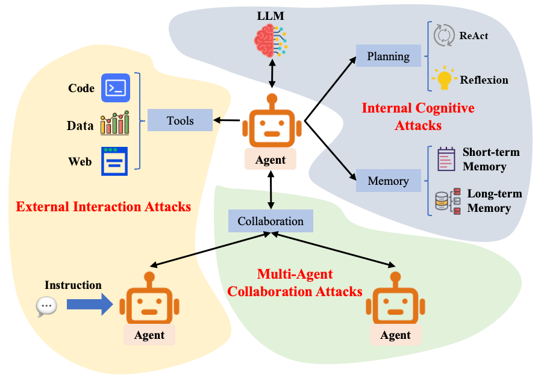
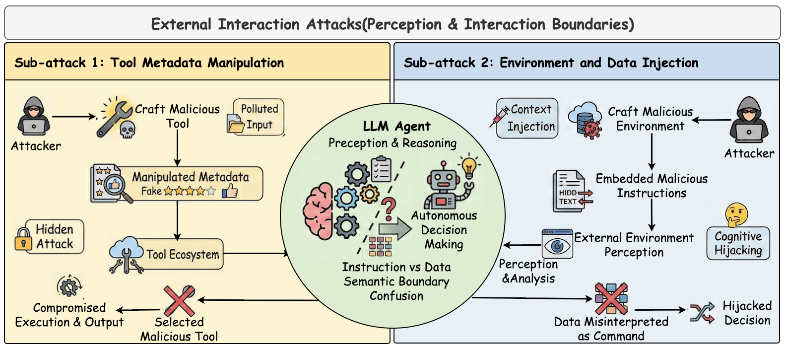
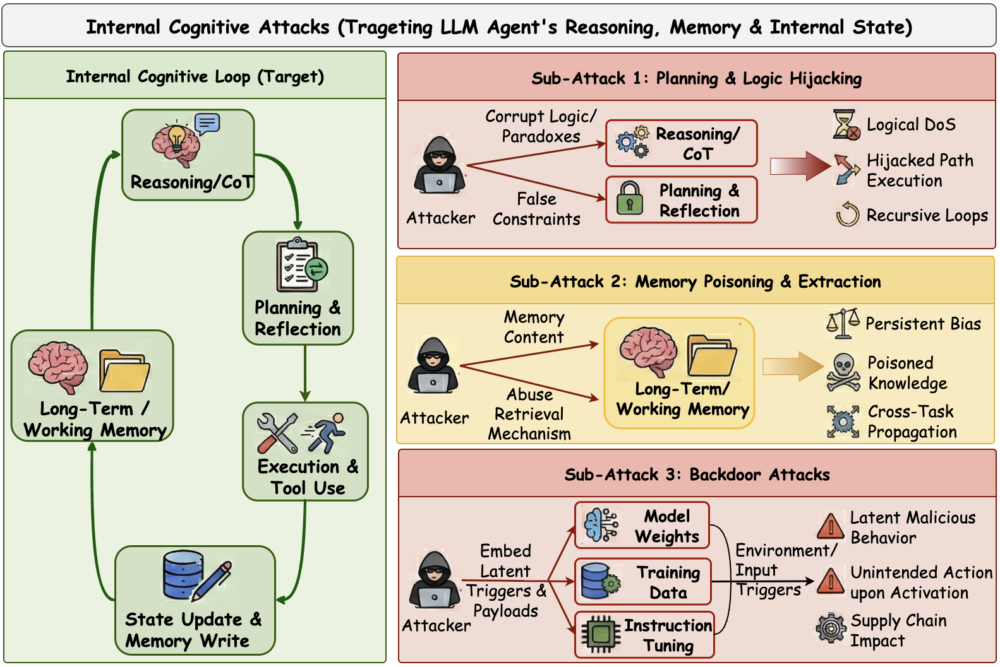
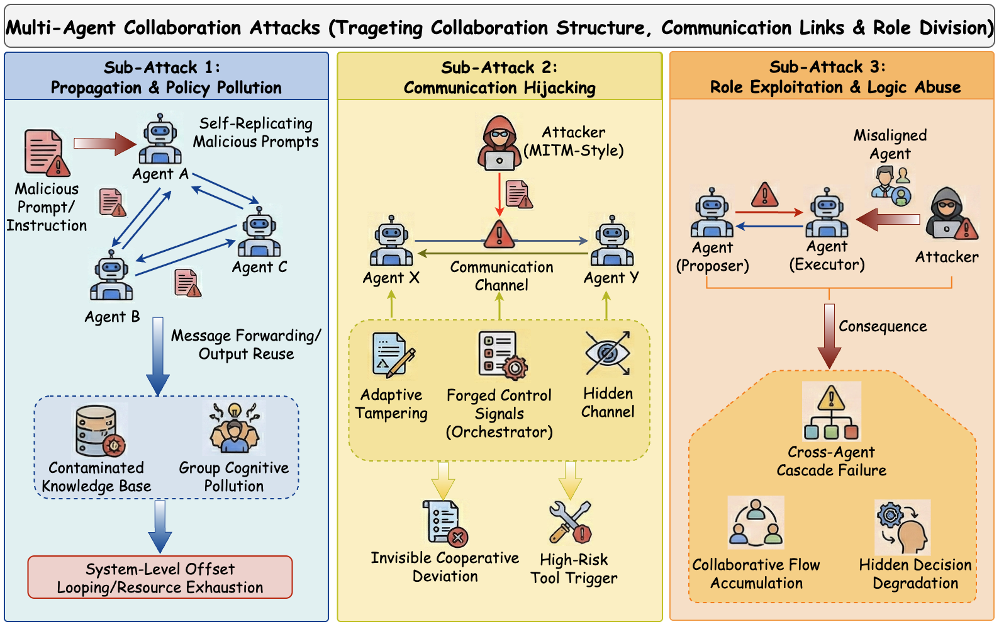
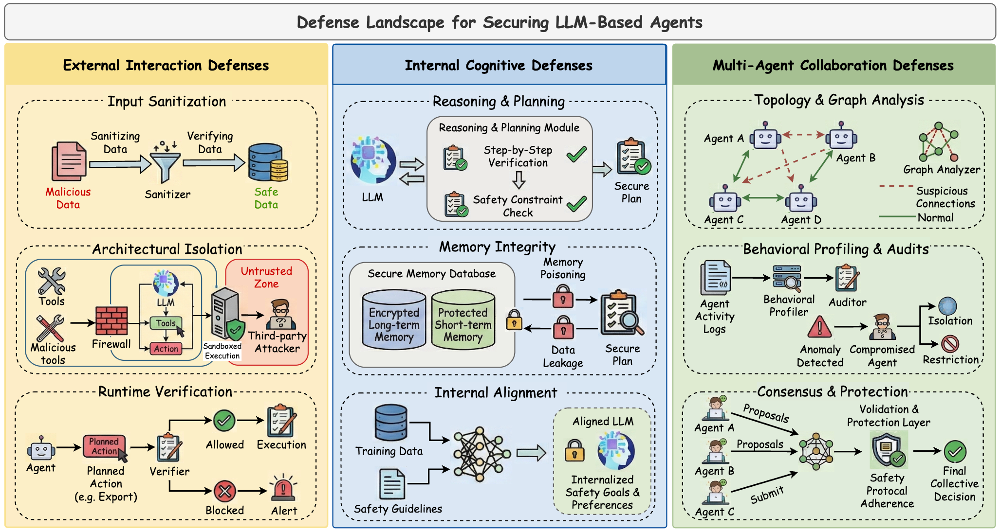

# A Survey on the Unique Security of Autonomous and Collaborative LLM Agents: Threats, Defenses, and Futures

**A living, venue-aware map of security research on autonomous and collaborative LLM agents.**

[](https://www.preprints.org/manuscript/202602.1655)
[](#paper-list)
[](https://github.com/sunyinggang/LLM-Agent-Security-Survey/issues/new)


Large Language Models are increasingly deployed as agents that plan, maintain memory, invoke tools, and collaborate with other agents. This repository accompanies our survey and provides a continuously maintained research map of **attacks, defenses, security frameworks, and benchmarks** for LLM agents.

Our taxonomy organizes the literature around three agent-specific threat paradigms: **External Interaction Attacks**, **Internal Cognitive Attacks**, and **Multi-Agent Collaboration Attacks**. It covers both single-agent and multi-agent systems, with a primary focus on papers from four leading security conferences and five leading AI and NLP conferences, together with other highly relevant papers:

**S&P · USENIX Security · CCS · NDSS · NeurIPS · ICML · ICLR · AAAI · ACL**

[Coverage](#coverage-at-a-glance) · [Browse by Taxonomy](#browse-by-taxonomy) · [Full Paper List](#paper-list) · [Citation](#citation)



## Coverage at a Glance

The repository currently covers **154 unique papers**. Of these, **110** were published at four leading security conferences and five leading AI and NLP conferences. The remaining **44** include **2 Findings of ACL papers**, **15 papers from other relevant peer-reviewed venues**, and **27 arXiv-only papers**.

**Literature window:** 2024–July 2026 for the core-venue review, supplemented by relevant earlier and adjacent studies retained in the full taxonomy.

### Core-Venue Coverage

| S&P | USENIX Security | CCS | NDSS | NeurIPS | ICML | ICLR | AAAI | ACL | **Total** |
|---:|---:|---:|---:|---:|---:|---:|---:|---:|---:|
| 3 | 1 | 1 | 7 | 15 | 25 | 15 | 10 | 33 | **110** |

## Browse by Taxonomy

| Research Area | Scope | Entries | Papers |
|---|---|---:|:---:|
| **External Interaction Attacks** | Environment, data, interface, tool metadata, and MCP-mediated attacks | 21 | [Browse](#external-interaction-attacks-1) |
| **Internal Cognitive Attacks** | Planning, reasoning, memory, retrieval, and backdoor attacks | 15 | [Browse](#internal-cognitive-attacks-1) |
| **Multi-Agent Collaboration Attacks** | Propagation, communication, collusion, workflow, and role exploitation | 19 | [Browse](#multi-agent-collaboration-attacks-1) |
| **External Interaction Defenses** | Input filtering, execution isolation, policy enforcement, and runtime verification | 24 | [Browse](#defenses-against-external-interaction-attacks) |
| **Internal Cognitive Defenses** | Reasoning safeguards, memory integrity, and internal alignment | 14 | [Browse](#defenses-against-internal-cognitive-attacks) |
| **Multi-Agent Collaboration Defenses** | Graph monitoring, malicious-agent detection, and resilient coordination | 18 | [Browse](#defenses-against-multi-agent-collaboration-attacks) |
| **Security Frameworks** | System architecture, governance, policy, and runtime supervision | 23 | [Browse](#security-frameworks) |
| **Security Benchmarks** | Safety, robustness, privacy, tool use, and domain-specific evaluation | 40 | [Browse](#security-benchmarks) |

## Taxonomy Overview

### External Interaction Attacks

Attacks on the agent–environment interface, including environment and data injection as well as tool-metadata manipulation.



### Internal Cognitive Attacks

Attacks that compromise planning, reasoning, memory, or model-internal behavior, including persistent and covert manipulation.



### Multi-Agent Collaboration Attacks

Attacks on communication, propagation, workflow dependencies, coordination logic, and role trust in multi-agent systems.



### Defenses

Defenses against external interaction, internal cognitive, and multi-agent collaboration attacks, together with system-level frameworks and security benchmarks.



## Table of Contents

- [Coverage at a Glance](#coverage-at-a-glance)
- [Browse by Taxonomy](#browse-by-taxonomy)
- [Taxonomy Overview](#taxonomy-overview)
  - [External Interaction Attacks](#external-interaction-attacks)
  - [Internal Cognitive Attacks](#internal-cognitive-attacks)
  - [Multi-Agent Collaboration Attacks](#multi-agent-collaboration-attacks)
  - [Defenses](#defenses)
- [Paper List](#paper-list)
  - [External Interaction Attacks](#external-interaction-attacks-1)
  - [Internal Cognitive Attacks](#internal-cognitive-attacks-1)
  - [Multi-Agent Collaboration Attacks](#multi-agent-collaboration-attacks-1)
  - [Defenses against External Interaction Attacks](#defenses-against-external-interaction-attacks)
  - [Defenses against Internal Cognitive Attacks](#defenses-against-internal-cognitive-attacks)
  - [Defenses against Multi-Agent Collaboration Attacks](#defenses-against-multi-agent-collaboration-attacks)
  - [Security Frameworks](#security-frameworks)
  - [Security Benchmarks](#security-benchmarks)
- [Contributing](#contributing)
- [Citation](#citation)
- [Acknowledgement](#acknowledgement)
- [Contact Us](#contact-us)

## Paper List

Venue labels identify the publication version recorded in the current BibTeX file. **[arXiv]** indicates that the cited entry is currently recorded as a preprint rather than a peer-reviewed proceedings version.

### External Interaction Attacks

- AdvAgent: Controllable Blackbox Red-teaming on Web Agents **[ICML 2025]** [[Paper](https://proceedings.mlr.press/v267/xu25m.html)]
- EIA: ENVIRONMENTAL INJECTION ATTACK ON GENERALIST WEB AGENTS FOR PRIVACY LEAKAGE **[ICLR 2025]** [[Paper](https://scholar.google.com/scholar?q=EIA%3A%20ENVIRONMENTAL%20INJECTION%20ATTACK%20ON%20GENERALIST%20WEB%20AGENTS%20FOR%20PRIVACY%20LEAKAGE)]
- Wipi: A new web threat for llm-driven web agents **[arXiv 2024]** [[Paper](https://arxiv.org/abs/2402.16965)]
- SafeSearch: Automated Red-Teaming of LLM-Based Search Agents **[ICML 2026]** [[Paper](https://icml.cc/virtual/2026/poster/65893)]
- Fact2Fiction: Targeted Poisoning Attack to Agentic Fact-checking System **[AAAI 2026]** [[Paper](https://ojs.aaai.org/index.php/AAAI/article/view/40353)]
- Attacking Vision-Language Computer Agents via Pop-ups **[ACL 2025]** [[Paper](https://aclanthology.org/2025.acl-long.411/)]
- MIP against Agent: Malicious Image Patches Hijacking Multimodal OS Agents **[NeurIPS 2025]** [[Paper](https://proceedings.neurips.cc/paper_files/paper/2025/hash/1add4b4f8373c64504cfe4a3054700a1-Abstract-Conference.html)]
- VPI-Bench: Visual Prompt Injection Attacks for Computer-Use Agents **[ICLR 2026]** [[Paper](https://arxiv.org/abs/2506.02456)]
- ChatInject: Abusing Chat Templates for Prompt Injection in LLM Agents **[ICLR 2026]** [[Paper](https://arxiv.org/abs/2509.22830)]
- ObliInjection: Order-Oblivious Prompt Injection Attack to LLM Agents with Multi-source Data **[NDSS 2026]** [[Paper](https://doi.org/10.14722/ndss.2026.240702)]
- Parasites in the Toolchain: A Large-Scale Analysis of Attacks on the MCP Ecosystem **[S&P 2026]** [[Paper](https://doi.org/10.1109/SP63933.2026.00154)]
- Prompt Injection as Role Confusion **[ICML 2026]** [[Paper](https://arxiv.org/abs/2603.12277)]
- Investigating the Impact of Dark Patterns on LLM-Based Web Agents **[S&P 2026]** [[Paper](https://doi.org/10.1109/SP63933.2026.00042)]
- Benchmarking Web Agent Safety under E-commerce Deceptive Interfaces **[ACL 2026]** [[Paper](https://aclanthology.org/2026.acl-long.1009/)]
- When Efficiency Becomes a Vulnerability: Computational Cost Attacks on WebAgents **[ACL 2026]** [[Paper](https://aclanthology.org/2026.acl-long.1775/)]
- AGENTVIGIL: Automatic Black-Box Red-teaming for Indirect Prompt Injection against LLM Agents **[Findings of EMNLP 2025]** [[Paper](https://aclanthology.org/2025.findings-emnlp.1258/)]
- Imprompter: Tricking llm agents into improper tool use **[arXiv 2024]** [[Paper](https://arxiv.org/abs/2410.14923)]
- Attractive Metadata Attack: Inducing LLM Agents to Invoke Malicious Tools **[NeurIPS 2025]** [[Paper](https://scholar.google.com/scholar?q=Attractive%20Metadata%20Attack%3A%20Inducing%20LLM%20Agents%20to%20Invoke%20Malicious%20Tools)]
- Prompt Injection Attack to Tool Selection in LLM Agents **[NDSS 2026]** [[Paper](https://doi.org/10.14722/ndss.2026.230675)]
- MPMA: Preference Manipulation Attack Against Model Context Protocol **[AAAI 2026]** [[Paper](https://ojs.aaai.org/index.php/AAAI/article/view/40898)]
- MCPTox: A Benchmark for Tool Poisoning on Real-World MCP Servers **[AAAI 2026]** [[Paper](https://ojs.aaai.org/index.php/AAAI/article/view/40895)]


### Internal Cognitive Attacks

- UDora: A Unified Red Teaming Framework against LLM Agents by Dynamically Hijacking Their Own Reasoning **[ICML 2025]** [[Paper](https://proceedings.mlr.press/v267/zhang25cl.html)]
- Breaking agents: Compromising autonomous llm agents through malfunction amplification **[EMNLP 2025]** [[Paper](https://scholar.google.com/scholar?q=Breaking%20agents%3A%20Compromising%20autonomous%20llm%20agents%20through%20malfunction%20amplification)]
- Watch out for your agents! investigating backdoor threats to llm-based agents **[NeurIPS 2024]** [[Paper](https://scholar.google.com/scholar?q=Watch%20out%20for%20your%20agents%21%20investigating%20backdoor%20threats%20to%20llm-based%20agents)]
- Stop Fixating on Prompts: Reasoning Hijacking and Constraint Tightening for Red-Teaming LLM Agents **[ACL 2026]** [[Paper](https://aclanthology.org/2026.acl-long.1197/)]
- Unveiling privacy risks in llm agent memory **[ACL 2025]** [[Paper](https://scholar.google.com/scholar?q=Unveiling%20privacy%20risks%20in%20llm%20agent%20memory)]
- Les Dissonances: Cross-Tool Harvesting and Polluting in Pool-of-Tools Empowered LLM Agents **[NDSS 2026]** [[Paper](https://doi.org/10.14722/ndss.2026.240577)]
- When GPT Spills the Tea: Comprehensive Assessment of Knowledge File Leakage in GPTs **[ACL 2025]** [[Paper](https://aclanthology.org/2025.acl-long.936/)]
- Agent Smith: A Single Image Can Jailbreak One Million Multimodal LLM Agents Exponentially Fast **[ICML 2024]** [[Paper](https://scholar.google.com/scholar?q=Agent%20Smith%3A%20A%20Single%20Image%20Can%20Jailbreak%20One%20Million%20Multimodal%20LLM%20Agents%20Exponentially%20Fast)]
- AgentPoison: Red-teaming LLM Agents via Poisoning Memory or Knowledge Bases **[NeurIPS 2024]** [[Paper](https://scholar.google.com/scholar?q=AgentPoison%3A%20Red-teaming%20LLM%20Agents%20via%20Poisoning%20Memory%20or%20Knowledge%20Bases)]
- Memory Injection Attacks on LLM Agents via Query-Only Interaction **[NeurIPS 2025]** [[Paper](https://papers.nips.cc/paper_files/paper/2025/file/42a97bbd9844d2bf68596730af80bcdf-Paper-Conference.pdf)]
- Memory poisoning attacks on retrieval-augmented Large Language Model agents via deceptive semantic reasoning **[Engineering Applications of AI 2026]** [[Paper](https://scholar.google.com/scholar?q=Memory%20poisoning%20attacks%20on%20retrieval-augmented%20Large%20Language%20Model%20agents%20via%20deceptive%20semantic%20reasoning)]
- MemIncept: Steering LLM Agents via Cooperative Stealthy Memory Injections **[ICML 2026]** [[Paper](https://openreview.net/forum?id=1YNrlSSRsk)]
- Visual Inception: Compromising Long-term Planning in Agentic Recommenders via Multimodal Memory Poisoning **[ACL 2026]** [[Paper](https://aclanthology.org/2026.acl-long.954/)]
- BadAgent: Inserting and Activating Backdoor Attacks in LLM Agents **[ACL 2024]** [[Paper](https://scholar.google.com/scholar?q=BadAgent%3A%20Inserting%20and%20Activating%20Backdoor%20Attacks%20in%20LLM%20Agents)]
- DemonAgent: Dynamically Encrypted Multi-Backdoor Implantation Attack on LLM-based Agent **[Findings of EMNLP 2025]** [[Paper](https://aclanthology.org/2025.findings-emnlp.157/)]


### Multi-Agent Collaboration Attacks

- Prompt Infection: LLM-to-LLM Prompt Injection within Multi-Agent Systems **[ESORICS Workshops 2025]** [[Paper](https://doi.org/10.1007/978-3-032-16092-8_28)]
- CORBA: Contagious Recursive Blocking Attacks on Multi-Agent Systems Based on Large Language Models **[Findings of ACL 2026]** [[Paper](https://aclanthology.org/2026.findings-acl.342/)]
- Agents under siege: Breaking pragmatic multi-agent llm systems with optimized prompt attacks **[ACL 2025]** [[Paper](https://scholar.google.com/scholar?q=Agents%20under%20siege%3A%20Breaking%20pragmatic%20multi-agent%20llm%20systems%20with%20optimized%20prompt%20attacks)]
- Flooding Spread of Manipulated Knowledge in LLM-Based Multi-Agent Communities **[Science China Information Sciences 2026]** [[Paper](https://doi.org/10.1007/s11432-024-4663-2)]
- A Troublemaker with Contagious Jailbreak Makes Chaos in Honest Towns **[ACL 2025]** [[Paper](https://aclanthology.org/2025.acl-long.859/)]
- Evo-Attacker: Memory-Augmented Reinforcement Learning for Long-Horizon Tool Attacks on LLM-MAS **[ACL 2026]** [[Paper](https://aclanthology.org/2026.acl-long.330/)]
- Multi-Agent Security Tax: Trading Off Security and Collaboration Capabilities in Multi-Agent Systems **[AAAI 2025]** [[Paper](https://ojs.aaai.org/index.php/AAAI/article/view/34970)]
- Red-teaming llm multi-agent systems via communication attacks **[Findings of ACL 2025]** [[Paper](https://scholar.google.com/scholar?q=Red-teaming%20llm%20multi-agent%20systems%20via%20communication%20attacks)]
- Attack the Messages, Not the Agents: A Multi-round Adaptive Stealthy Tampering Framework for LLM-MAS **[AAAI 2026]** [[Paper](https://doi.org/10.1609/aaai.v40i35.40224)]
- Multi-agent systems execute arbitrary malicious code **[arXiv 2025]** [[Paper](https://arxiv.org/abs/2503.12188)]
- Secret Collusion among AI Agents: Multi-Agent Deception via Steganography **[NeurIPS 2024]** [[Paper](https://scholar.google.com/scholar?q=Secret%20Collusion%20among%20AI%20Agents%3A%20Multi-Agent%20Deception%20via%20Steganography)]
- Conjunctive Prompt Attacks in Multi-Agent LLM Systems **[ACL 2026]** [[Paper](https://aclanthology.org/2026.acl-long.1577/)]
- Evil geniuses: Delving into the safety of llm-based agents **[arXiv 2023]** [[Paper](https://arxiv.org/abs/2311.11855)]
- On the Resilience of LLM-Based Multi-Agent Collaboration with Faulty Agents **[ICML 2025]** [[Paper](https://scholar.google.com/scholar?q=On%20the%20Resilience%20of%20LLM-Based%20Multi-Agent%20Collaboration%20with%20Faulty%20Agents)]
- Who's the Mole? Modeling and Detecting Intention-Hiding Malicious Agents in LLM-Based Multi-Agent Systems **[arXiv 2025]** [[Paper](https://arxiv.org/abs/2507.04724)]
- Ip leakage attacks targeting llm-based multi-agent systems **[arXiv 2025]** [[Paper](https://arxiv.org/abs/2505.12442)]
- PsySafe: A Comprehensive Framework for Psychological-based Attack, Defense, and Evaluation of Multi-agent System Safety **[ACL 2024]** [[Paper](https://aclanthology.org/2024.acl-long.812/)]
- Lying with Truths: Open-Channel Multi-Agent Collusion for Belief Manipulation via Generative Montage **[ACL 2026]** [[Paper](https://aclanthology.org/2026.acl-long.270/)]
- Shadows in the Code: Exploring the Risks and Defenses of LLM-based Multi-Agent Software Development Systems **[AAAI 2026]** [[Paper](https://ojs.aaai.org/index.php/AAAI/article/view/41134)]


#### Defenses against External Interaction Attacks

- Promptarmor: Simple yet effective prompt injection defenses **[arXiv 2025]** [[Paper](https://arxiv.org/abs/2507.15219)]
- To Protect the LLM Agent Against the Prompt Injection Attack with Polymorphic Prompt **[DSN 2025]** [[Paper](https://scholar.google.com/scholar?q=To%20Protect%20the%20LLM%20Agent%20Against%20the%20Prompt%20Injection%20Attack%20with%20Polymorphic%20Prompt)]
- Attention is All You Need to Defend Against Indirect Prompt Injection Attacks in LLMs **[NDSS 2026]** [[Paper](https://doi.org/10.14722/ndss.2026.240394)]
- RedVisor: Reasoning-Aware Prompt Injection Defense via Zero-Copy KV Cache Reuse **[ICML 2026]** [[Paper](https://arxiv.org/abs/2602.01795)]
- Can Indirect Prompt Injection Attacks Be Detected and Removed? **[ACL 2025]** [[Paper](https://aclanthology.org/2025.acl-long.890/)]
- Defenses Against Prompt Attacks Learn Surface Heuristics **[ACL 2026]** [[Paper](https://aclanthology.org/2026.acl-long.502/)]
- CachePrune: Teaching LLMs What Not to Follow via KV-Cache Editing **[ACL 2026]** [[Paper](https://aclanthology.org/2026.acl-long.70/)]
- Defense Against Prompt Injection Attack by Leveraging Attack Techniques **[ACL 2025]** [[Paper](https://aclanthology.org/2025.acl-long.897/)]
- IsolateGPT: An Execution Isolation Architecture for LLM-Based Systems **[NDSS 2025]** [[Paper](https://doi.org/10.14722/ndss.2025.241131)]
- AirGapAgent: Protecting Privacy-Conscious Conversational Agents **[CCS 2024]** [[Paper](https://doi.org/10.1145/3658644.3690350)]
- CaMeLs Can Use Computers Too: System-level Security for Computer Use Agents **[arXiv 2026]** [[Paper](https://arxiv.org/abs/2601.09923)]
- EcoAgent: An Efficient Device-Cloud Collaborative Multi-Agent Framework for Mobile Automation **[AAAI 2026]** [[Paper](https://ojs.aaai.org/index.php/AAAI/article/view/40230)]
- The task shield: Enforcing task alignment to defend against indirect prompt injection in llm agents **[ACL 2025]** [[Paper](https://scholar.google.com/scholar?q=The%20task%20shield%3A%20Enforcing%20task%20alignment%20to%20defend%20against%20indirect%20prompt%20injection%20in%20llm%20agents)]
- MELON: Provable Defense Against Indirect Prompt Injection Attacks in AI Agents **[ICML 2025]** [[Paper](https://scholar.google.com/scholar?q=MELON%3A%20Provable%20Defense%20Against%20Indirect%20Prompt%20Injection%20Attacks%20in%20AI%20Agents)]
- ShieldAgent: Shielding Agents via Verifiable Safety Policy Reasoning **[ICML 2025]** [[Paper](https://scholar.google.com/scholar?q=ShieldAgent%3A%20Shielding%20Agents%20via%20Verifiable%20Safety%20Policy%20Reasoning)]
- Ipiguard: A novel tool dependency graph-based defense against indirect prompt injection in llm agents **[EMNLP 2025]** [[Paper](https://scholar.google.com/scholar?q=Ipiguard%3A%20A%20novel%20tool%20dependency%20graph-based%20defense%20against%20indirect%20prompt%20injection%20in%20llm%20agents)]
- DRIFT: Dynamic Rule-Based Defense with Injection Isolation for Securing LLM Agents **[NeurIPS 2025]** [[Paper](https://proceedings.neurips.cc/paper_files/paper/2025/hash/77f3b26c7907aa27b207df9b9d43f29a-Abstract-Conference.html)]
- ALRPHFS: Adversarially Learned Risk Patterns with Hierarchical Fast & Slow Reasoning for Robust Agent Defense **[Findings of EMNLP 2025]** [[Paper](https://aclanthology.org/2025.findings-emnlp.1066/)]
- GuardAgent: Safeguard LLM Agents via Knowledge-Enabled Reasoning **[ICML 2025]** [[Paper](https://proceedings.mlr.press/v267/xiang25a.html)]
- VIGIL: Defending LLM Agents Against Tool-Stream Injection via Verify-Before-Commit **[ACL 2026]** [[Paper](https://aclanthology.org/2026.acl-long.443/)]
- CausalArmor: Efficient Indirect Prompt Injection Guardrails via Causal Attribution **[ICML 2026]** [[Paper](https://arxiv.org/abs/2602.07918)]
- Don't Click That: Teaching Web Agents to Resist Deceptive Interfaces **[ACL 2026]** [[Paper](https://aclanthology.org/2026.acl-long.310/)]
- Causal Detection of Multi-Step LLM Agent Attacks **[ICML 2026]** [[Paper](https://icml.cc/virtual/2026/poster/64714)]
- Speculative Safety Honeypot: Toward Proactive Defense Against Multi-turn Agent Attacks **[ICML 2026]** [[Paper](https://openreview.net/forum?id=F7KJeI4oql)]


#### Defenses against Internal Cognitive Attacks

- Your Agent Can Defend Itself against Backdoor Attacks **[arXiv 2025]** [[Paper](https://arxiv.org/abs/2506.08336)]
- Get Experience from Practice: LLM Agents with Record & Replay **[arXiv 2025]** [[Paper](https://arxiv.org/abs/2505.17716)]
- Check Yourself Before You Wreck Yourself: Selectively Quitting Improves LLM Agent Safety **[arXiv 2025]** [[Paper](https://arxiv.org/abs/2510.16492)]
- SafeHarbor: Defining Precise Decision Boundaries via Hierarchical Memory-Augmented Guardrail for LLM Agent Safety **[ICML 2026]** [[Paper](https://arxiv.org/abs/2605.05704)]
- SafeAgent: Safeguarding LLM Agents via an Automated Risk Simulator **[ACL 2026]** [[Paper](https://aclanthology.org/2026.acl-long.1501/)]
- A-MemGuard: A Proactive Defense Framework for LLM-Based Agent Memory **[arXiv 2025]** [[Paper](https://arxiv.org/abs/2510.02373)]
- Agentsafe: Safeguarding large language model-based multi-agent systems via hierarchical data management **[arXiv 2025]** [[Paper](https://arxiv.org/abs/2503.04392)]
- Memory Poisoning Attack and Defense on Memory Based LLM-Agents **[arXiv 2026]** [[Paper](https://arxiv.org/abs/2601.05504)]
- Visual Inception: Compromising Long-term Planning in Agentic Recommenders via Multimodal Memory Poisoning **[ACL 2026]** [[Paper](https://aclanthology.org/2026.acl-long.954/)]
- When Personalization Legitimizes Risks: Uncovering Safety Vulnerabilities in Personalized Dialogue Agents **[ACL 2026]** [[Paper](https://aclanthology.org/2026.acl-long.1260/)]
- AdvEvo-MARL: Shaping Internalized Safety through Adversarial Co-Evolution in Multi-Agent Reinforcement Learning **[arXiv 2025]** [[Paper](https://arxiv.org/abs/2510.01586)]
- Real ai agents with fake memories: Fatal context manipulation attacks on web3 agents **[arXiv 2025]** [[Paper](https://arxiv.org/abs/2503.16248)]
- PrivAct: Internalizing Contextual Privacy Preservation via Multi-Agent Preference Training **[ICML 2026]** [[Paper](https://icml.cc/virtual/2026/poster/65131)]
- Privacy Collapse: Benign Fine-Tuning Can Break Contextual Privacy in Language Models **[ACL 2026]** [[Paper](https://aclanthology.org/2026.acl-long.400/)]


#### Defenses against Multi-Agent Collaboration Attacks

- G-Safeguard: A Topology-Guided Security Lens and Treatment on LLM-based Multi-agent Systems **[ACL 2025]** [[Paper](https://scholar.google.com/scholar?q=G-Safeguard%3A%20A%20Topology-Guided%20Security%20Lens%20and%20Treatment%20on%20LLM-based%20Multi-agent%20Systems)]
- GUARDIAN: Safeguarding LLM Multi-Agent Collaborations with Temporal Graph Modeling **[NeurIPS 2025]** [[Paper](https://proceedings.neurips.cc/paper_files/paper/2025/file/0bc795afae289ed465a65a3b4b1f4eb7-Paper-Conference.pdf)]
- BlindGuard: Safeguarding LLM-based Multi-Agent Systems under Unknown Attacks **[ACL 2026]** [[Paper](https://aclanthology.org/2026.acl-long.1819/)]
- INFA-Guard: Mitigating Malicious Propagation via Infection-Aware Safeguarding in LLM-Based Multi-Agent Systems **[arXiv 2026]** [[Paper](https://arxiv.org/abs/2601.14667)]
- Explainable and Fine-Grained Safeguarding of LLM Multi-Agent Systems via Bi-Level Graph Anomaly Detection **[ACL 2026]** [[Paper](https://aclanthology.org/2026.acl-long.1407/)]
- Architecture Matters for Multi-Agent Security **[ICML 2026]** [[Paper](https://openreview.net/forum?id=Jk4zLorDUx)]
- ResMAS: Resilience Optimization in LLM-based Multi-agent Systems **[AAAI 2026]** [[Paper](https://ojs.aaai.org/index.php/AAAI/article/view/40824)]
- Who's the Mole? Modeling and Detecting Intention-Hiding Malicious Agents in LLM-Based Multi-Agent Systems **[arXiv 2025]** [[Paper](https://arxiv.org/abs/2507.04724)]
- MedSentry: Understanding and Mitigating Safety Risks in Medical LLM Multi-Agent Systems **[arXiv 2025]** [[Paper](https://arxiv.org/abs/2505.20824)]
- PeerGuard: Defending Multi-Agent Systems Against Backdoor Attacks Through Mutual Reasoning **[IRI 2025]** [[Paper](https://scholar.google.com/scholar?q=PeerGuard%3A%20Defending%20Multi-Agent%20Systems%20Against%20Backdoor%20Attacks%20Through%20Mutual%20Reasoning)]
- On the Resilience of LLM-Based Multi-Agent Collaboration with Faulty Agents **[ICML 2025]** [[Paper](https://scholar.google.com/scholar?q=On%20the%20Resilience%20of%20LLM-Based%20Multi-Agent%20Collaboration%20with%20Faulty%20Agents)]
- PsySafe: A Comprehensive Framework for Psychological-based Attack, Defense, and Evaluation of Multi-agent System Safety **[ACL 2024]** [[Paper](https://aclanthology.org/2024.acl-long.812/)]
- When Agents Go Rogue: Activation-Based Detection of Malicious Behaviors in Multi-Agent Systems **[ICML 2026]** [[Paper](https://icml.cc/virtual/2026/poster/65619)]
- Enhancing Robustness of LLM-Driven Multi-Agent Systems through Randomized Smoothing **[Chinese Journal of Aeronautics 2026]** [[Paper](https://doi.org/10.1016/j.cja.2025.103779)]
- Rethinking the Reliability of Multi-agent System: A Perspective from Byzantine Fault Tolerance **[AAAI 2026]** [[Paper](https://ojs.aaai.org/index.php/AAAI/article/view/40806)]
- CoTGuard: Using Chain-of-Thought Triggering for Copyright Protection in Multi-Agent LLM Systems **[arXiv 2025]** [[Paper](https://arxiv.org/abs/2505.19405)]
- Shadows in the Code: Exploring the Risks and Defenses of LLM-based Multi-Agent Software Development Systems **[AAAI 2026]** [[Paper](https://ojs.aaai.org/index.php/AAAI/article/view/41134)]
- Multi-agent systems execute arbitrary malicious code **[arXiv 2025]** [[Paper](https://arxiv.org/abs/2503.12188)]


#### Security Frameworks

- Aios: Llm agent operating system **[arXiv 2024]** [[Paper](https://arxiv.org/abs/2403.16971)]
- IsolateGPT: An Execution Isolation Architecture for LLM-Based Systems **[NDSS 2025]** [[Paper](https://doi.org/10.14722/ndss.2025.241131)]
- AirGapAgent: Protecting Privacy-Conscious Conversational Agents **[CCS 2024]** [[Paper](https://doi.org/10.1145/3658644.3690350)]
- Security of ai agents **[RAIE 2025]** [[Paper](https://scholar.google.com/scholar?q=Security%20of%20ai%20agents)]
- ACE: A Security Architecture for LLM-Integrated App Systems **[NDSS 2026]** [[Paper](https://doi.org/10.14722/ndss.2026.230352)]
- MaMa: A Game-Theoretic Approach for Designing Safe Agentic Systems **[ICML 2026]** [[Paper](https://icml.cc/virtual/2026/poster/64729)]
- Architecture Matters for Multi-Agent Security **[ICML 2026]** [[Paper](https://openreview.net/forum?id=Jk4zLorDUx)]
- EcoAgent: An Efficient Device-Cloud Collaborative Multi-Agent Framework for Mobile Automation **[AAAI 2026]** [[Paper](https://ojs.aaai.org/index.php/AAAI/article/view/40230)]
- Privacy-R1: Privacy-Aware Multi-LLM Agent Collaboration via Reinforcement Learning **[ACL 2026]** [[Paper](https://aclanthology.org/2026.acl-long.2130/)]
- TrustAgent: Towards Safe and Trustworthy LLM-based Agents **[Findings of EMNLP 2024]** [[Paper](https://aclanthology.org/2024.findings-emnlp.585/)]
- ShieldAgent: Shielding Agents via Verifiable Safety Policy Reasoning **[ICML 2025]** [[Paper](https://scholar.google.com/scholar?q=ShieldAgent%3A%20Shielding%20Agents%20via%20Verifiable%20Safety%20Policy%20Reasoning)]
- Position: Trustworthy AI Agents Require the Integration of Large Language Models and Formal Methods **[ICML 2025]** [[Paper](https://proceedings.mlr.press/v267/zhang25ds.html)]
- AgentBreeder: Mitigating the AI Safety Impact of Multi-Agent Scaffolds via Self-Improvement **[Workshop 2025]** [[Paper](https://scholar.google.com/scholar?q=AgentBreeder%3A%20Mitigating%20the%20AI%20Safety%20Impact%20of%20Multi-Agent%20Scaffolds%20via%20Self-Improvement)]
- Shapley-Coop: Credit Assignment for Emergent Cooperation in Self-Interested LLM Agents **[arXiv 2025]** [[Paper](https://arxiv.org/abs/2506.07388)]
- Securing Agentic AI: A Comprehensive Threat Model and Mitigation Framework for Generative AI Agents **[ACAI 2025]** [[Paper](https://doi.org/10.1109/ACAI68217.2025.11406310)]
- SAGA: A Security Architecture for Governing AI Agentic Systems **[NDSS 2026]** [[Paper](https://doi.org/10.14722/ndss.2026.230869)]
- Towards Automating Data Access Permissions in AI Agents **[S&P 2026]** [[Paper](https://doi.org/10.1109/SP63933.2026.00018)]
- The task shield: Enforcing task alignment to defend against indirect prompt injection in llm agents **[ACL 2025]** [[Paper](https://scholar.google.com/scholar?q=The%20task%20shield%3A%20Enforcing%20task%20alignment%20to%20defend%20against%20indirect%20prompt%20injection%20in%20llm%20agents)]
- Sentinel Agents for Secure and Trustworthy Agentic AI in Multi-Agent Systems **[arXiv 2025]** [[Paper](https://arxiv.org/abs/2509.14956)]
- Llamafirewall: An open source guardrail system for building secure ai agents **[arXiv 2025]** [[Paper](https://arxiv.org/abs/2505.03574)]
- AGrail: A Lifelong Agent Guardrail with Effective and Adaptive Safety Detection **[ACL 2025]** [[Paper](https://aclanthology.org/2025.acl-long.399/)]
- Reliable Weak-to-Strong Monitoring of LLM Agents **[ICLR 2026]** [[Paper](https://arxiv.org/abs/2508.19461)]
- AIR: Improving Agent Safety through Incident Response **[ICML 2026]** [[Paper](https://arxiv.org/abs/2602.11749)]


#### Security Benchmarks

- AgentHarm: A Benchmark for Measuring Harmfulness of LLM Agents **[ICLR 2025]** [[Paper](https://proceedings.iclr.cc/paper_files/paper/2025/hash/c493d23af93118975cdbc32cbe7323f5-Abstract-Conference.html)]
- PropensityBench: Evaluating Latent Safety Risks in Large Language Models via an Agentic Approach **[ICLR 2026]** [[Paper](https://openreview.net/forum?id=jOTQupHx7q)]
- Unsafer in Many Turns: Benchmarking and Defending Multi-Turn Safety Risks in Tool-Using Agents **[ICML 2026]** [[Paper](https://openreview.net/forum?id=iSuqYRmG4A)]
- TAMAS: Benchmarking Adversarial Risks in Multi-Agent LLM Systems **[ACL 2026]** [[Paper](https://aclanthology.org/2026.acl-long.1442/)]
- Agentdojo: A dynamic environment to evaluate prompt injection attacks and defenses for llm agents **[NeurIPS 2024]** [[Paper](https://scholar.google.com/scholar?q=Agentdojo%3A%20A%20dynamic%20environment%20to%20evaluate%20prompt%20injection%20attacks%20and%20defenses%20for%20llm%20agents)]
- ToolSword: Unveiling Safety Issues of Large Language Models in Tool Learning Across Three Stages **[ACL 2024]** [[Paper](https://aclanthology.org/2024.acl-long.119/)]
- MCP-SafetyBench: A Benchmark for Safety Evaluation of Large Language Models with Real-World MCP Servers **[ICLR 2026]** [[Paper](https://arxiv.org/abs/2512.15163)]
- MCPTox: A Benchmark for Tool Poisoning on Real-World MCP Servers **[AAAI 2026]** [[Paper](https://ojs.aaai.org/index.php/AAAI/article/view/40895)]
- WASP: Benchmarking Web Agent Security Against Prompt Injection Attacks **[NeurIPS 2025]** [[Paper](https://proceedings.neurips.cc/paper_files/paper/2025/hash/1c9818387f5dd0a0bc151214660f059d-Abstract-Datasets_and_Benchmarks_Track.html)]
- Security Challenges in AI Agent Deployment: Insights from a Large Scale Public Competition **[NeurIPS 2025]** [[Paper](https://proceedings.neurips.cc/paper_files/paper/2025/hash/73368bc7644c054b5bcc6490a8f2fb1c-Abstract-Datasets_and_Benchmarks_Track.html)]
- VPI-Bench: Visual Prompt Injection Attacks for Computer-Use Agents **[ICLR 2026]** [[Paper](https://arxiv.org/abs/2506.02456)]
- ACIArena: Toward Unified Evaluation for Agent Cascading Injection **[ACL 2026]** [[Paper](https://aclanthology.org/2026.acl-long.457/)]
- PrivacyLens: Evaluating Privacy Norm Awareness of Language Models in Action **[NeurIPS 2024]** [[Paper](https://proceedings.neurips.cc/paper_files/paper/2024/hash/a2a7e58309d5190082390ff10ff3b2b8-Abstract-Datasets_and_Benchmarks_Track.html)]
- Aligned LLMs Are Not Aligned Browser Agents **[ICLR 2025]** [[Paper](https://proceedings.iclr.cc/paper_files/paper/2025/hash/42f92b78a6695f60db0cd38b54d57a41-Abstract-Conference.html)]
- Mind the Third Eye! Benchmarking Privacy Awareness in MLLM-powered Smartphone Agents **[AAAI 2026]** [[Paper](https://ojs.aaai.org/index.php/AAAI/article/view/40874)]
- ST-WebAgentBench: A Benchmark for Evaluating Safety and Trustworthiness in Web Agents **[ICLR 2026]** [[Paper](https://arxiv.org/abs/2410.06703)]
- OpenAgentSafety: A Comprehensive Framework for Evaluating Real-World AI Agent Safety **[arXiv 2025]** [[Paper](https://arxiv.org/abs/2507.06134)]
- Agentauditor: Human-level safety and security evaluation for llm agents **[arXiv 2025]** [[Paper](https://arxiv.org/abs/2506.00641)]
- ALI-Agent: Assessing LLMs' Alignment with Human Values via Agent-based Evaluation **[NeurIPS 2024]** [[Paper](https://proceedings.neurips.cc/paper_files/paper/2024/hash/b35c38f70065ac6c694089ca93a015bb-Abstract-Conference.html)]
- Identifying the Risks of LM Agents with an LM-Emulated Sandbox **[ICLR 2024]** [[Paper](https://scholar.google.com/scholar?q=Identifying%20the%20Risks%20of%20LM%20Agents%20with%20an%20LM-Emulated%20Sandbox)]
- ToolFuzz--Automated Agent Tool Testing **[arXiv 2025]** [[Paper](https://arxiv.org/abs/2503.04479)]
- Attractive Metadata Attack: Inducing LLM Agents to Invoke Malicious Tools **[NeurIPS 2025]** [[Paper](https://scholar.google.com/scholar?q=Attractive%20Metadata%20Attack%3A%20Inducing%20LLM%20Agents%20to%20Invoke%20Malicious%20Tools)]
- Agent Security Bench (ASB): Formalizing and Benchmarking Attacks and Defenses in LLM-based Agents **[ICLR 2025]** [[Paper](https://proceedings.iclr.cc/paper_files/paper/2025/file/5750f91d8fb9d5c02bd8ad2c3b44456b-Paper-Conference.pdf)]
- MCP Security Bench (MSB): Benchmarking Attacks Against Model Context Protocol in LLM Agents **[ICLR 2026]** [[Paper](https://openreview.net/forum?id=irxxkFMrry)]
- Dissecting Adversarial Robustness of Multimodal LM Agents **[ICLR 2025]** [[Paper](https://proceedings.iclr.cc/paper_files/paper/2025/hash/460a1d8eac34125dad453b28d6d64446-Abstract-Conference.html)]
- ShieldAgent: Shielding Agents via Verifiable Safety Policy Reasoning **[ICML 2025]** [[Paper](https://scholar.google.com/scholar?q=ShieldAgent%3A%20Shielding%20Agents%20via%20Verifiable%20Safety%20Policy%20Reasoning)]
- SafeSearch: Automated Red-Teaming of LLM-Based Search Agents **[ICML 2026]** [[Paper](https://icml.cc/virtual/2026/poster/65893)]
- AgentLAB: Benchmarking LLM Agents against Long-Horizon Attacks **[ICML 2026]** [[Paper](https://icml.cc/virtual/2026/poster/65640)]
- Breaking Agent Backbones: Evaluating the Security of Backbone LLMs in AI Agents **[ICLR 2026]** [[Paper](https://arxiv.org/abs/2510.22620)]
- Redcode: Risky code execution and generation benchmark for code agents **[NeurIPS 2024]** [[Paper](https://scholar.google.com/scholar?q=Redcode%3A%20Risky%20code%20execution%20and%20generation%20benchmark%20for%20code%20agents)]
- Breaking the code: Security assessment of ai code agents through systematic jailbreaking attacks **[arXiv 2025]** [[Paper](https://arxiv.org/abs/2510.01359)]
- CVE-Bench: A Benchmark for AI Agents' Ability to Exploit Real-World Web Application Vulnerabilities **[ICML 2025]** [[Paper](https://scholar.google.com/scholar?q=CVE-Bench%3A%20A%20Benchmark%20for%20AI%20Agents%27%20Ability%20to%20Exploit%20Real-World%20Web%20Application%20Vulnerabilities)]
- SafeArena: Evaluating the Safety of Autonomous Web Agents **[ICML 2025]** [[Paper](https://proceedings.mlr.press/v267/tur25a.html)]
- RedCodeAgent: Automatic Red-teaming Agent against Diverse Code Agents **[ICLR 2026]** [[Paper](https://openreview.net/forum?id=IyIaAOihmZ)]
- Autonomy Comes with Costs: Detecting Denial-of-Service Vulnerabilities Caused by Resource Abusing in LLM-based Agents **[USENIX Security 2026]** [[Paper](https://www.usenix.org/conference/usenixsecurity26/presentation/luo)]
- AgentDAM: Privacy Leakage Evaluation for Autonomous Web Agents **[NeurIPS 2025]** [[Paper](https://papers.neurips.cc/paper_files/paper/2025/hash/c9826b9ea5e1b49b256329934a578d83-Abstract-Datasets_and_Benchmarks_Track.html)]
- When GPT Spills the Tea: Comprehensive Assessment of Knowledge File Leakage in GPTs **[ACL 2025]** [[Paper](https://aclanthology.org/2025.acl-long.936/)]
- When "Correct" Is Not Safe: Can We Trust Functionally Correct Patches Generated by Code Agents? **[ACL 2026]** [[Paper](https://aclanthology.org/2026.acl-long.707/)]
- Benchmarking Web Agent Safety under E-commerce Deceptive Interfaces **[ACL 2026]** [[Paper](https://aclanthology.org/2026.acl-long.1009/)]
- Don't Click That: Teaching Web Agents to Resist Deceptive Interfaces **[ACL 2026]** [[Paper](https://aclanthology.org/2026.acl-long.310/)]


## Contributing

Contributions are welcome. If we missed a relevant paper or recorded incorrect publication information, please [open an issue](https://github.com/sunyinggang/LLM-Agent-Security-Survey/issues/new) or submit a pull request.

For a new paper, please provide:

- official paper title and author list;
- publication venue and year;
- DOI or official paper URL;
- suggested survey category and subcategory;
- code, dataset, or project link, when available.

We prioritize work on the security of LLM agents themselves. Research that only uses agents as security tools, without studying risks, attacks, defenses, frameworks, or evaluations of the agents, is outside the primary scope of this repository.


## Citation

If you find this survey useful, please cite:
```bibtex
@article{202602.1655,
  doi = {10.20944/preprints202602.1655.v1},
  url = {https://doi.org/10.20944/preprints202602.1655.v1},
  year = {2026},
  month = {February},
  publisher = {Preprints},
  author = {Yinggang Sun and Haining Yu and Wei Jiang and Xiangzhan Yu and Dongyang Zhan and Lixu Wang and Siyue Ren and Yue Sun and Tianqing Zhu},
  title = {A Survey on the Unique Security of Autonomous and Collaborative LLM Agents: Threats, Defenses, and Futures},
  journal = {Preprints}
}
```

## Acknowledgement

Thanks to all collaborators and to the research community whose work is summarized in this repository. Suggestions for missing papers, corrected publication metadata, or improved categorization are welcome.

## Contact Us

For suggestions or corrections, please contact:
- syg15688708938@163.com
